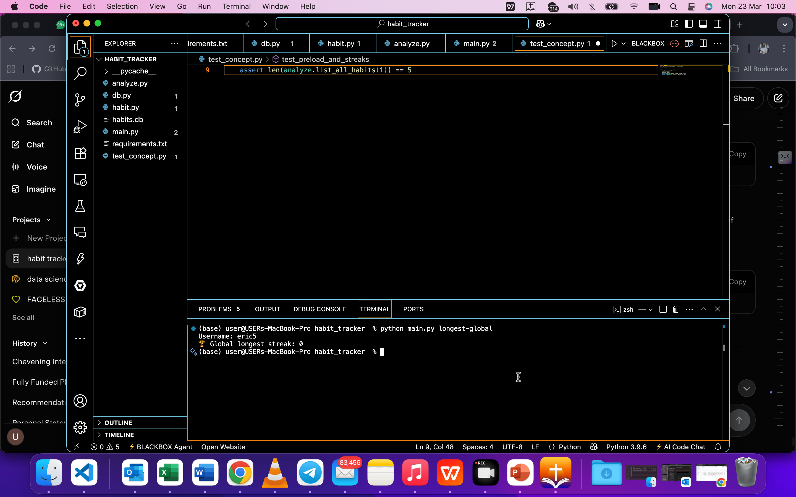

# Habit Tracker Application

**Object Oriented and Functional Programming with Python**  
Uchechukwu Agu (92131611) – IU Portfolio Project

## Installation
```bash
pip install -r requirements.txt
python main.py
## Project Structure
- `db.py` → Database connection, tables, preload data  
- `habit.py` → OOP classes (User, Habit, Completion, Streak)  
- `analyze.py` → Functional programming analytics module  
- `main.py` → Click CLI interface  
- `test_concept.py` → Unit tests  
- `.gitignore` → Clean repository (no cache or database files)

## Predefined Data (as required)
- 5 habits (3 daily + 2 weekly)  
- 4 weeks of example tracking data (28 days) with intentional breaks  
- Used for testing streak calculations

## How to Use (with screenshots)

### 1. Register a user


### 2. Create habit + Log completion


### 3. Analytics – Global Longest Streak


### 4. Run Unit Tests


## Analytics Module (Functional Programming)
- List all habits
- List by periodicity (daily/weekly)
- Longest streak per habit
- Global longest streak
- Inactive habits (6+ months)

## Unit Tests
Covers habit creation/deletion + every analytics function.

---

**Repository created for IU final submission**  
March 2026
